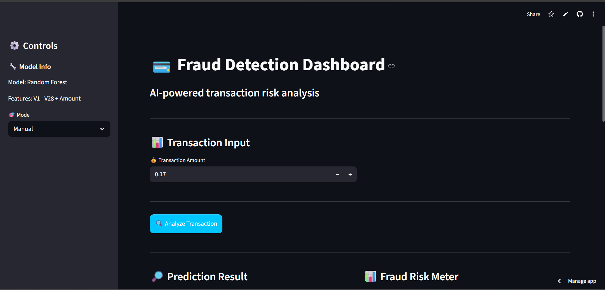
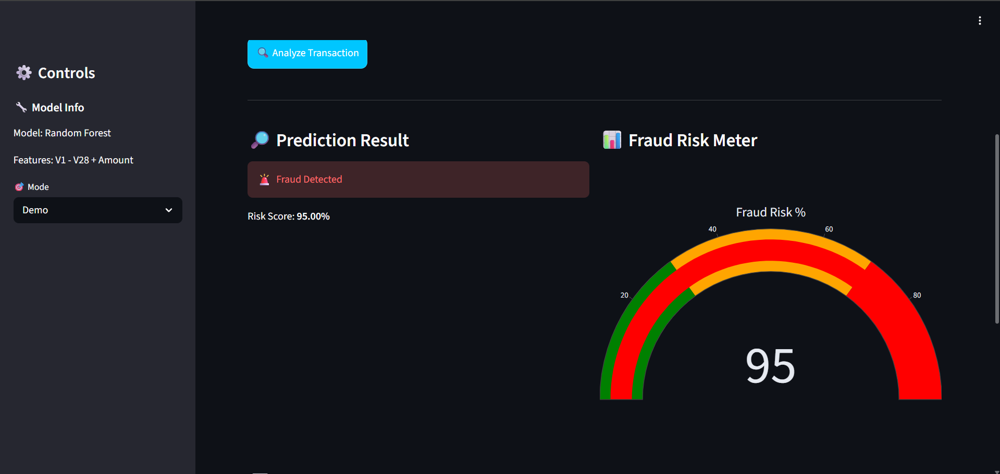
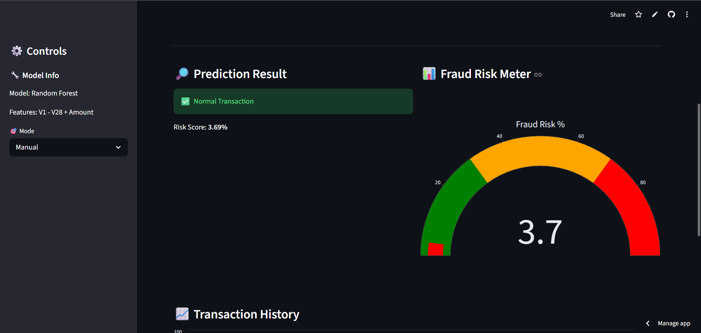
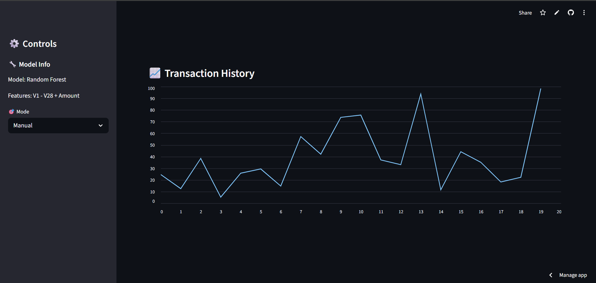

# fraud-detection-system
Fraud detection system using machine learning with Streamlit dashboard and risk visualization

# 💳 Fraud Detection System

## 📌 Overview
This project detects fraudulent transactions using machine learning.

## 🚀 Features
- Random Forest model
- SMOTE for imbalance handling
- Streamlit dashboard
- Risk score visualization (gauge chart)
- Demo mode simulation

## 🛠 Tech Stack
- Python
- Pandas, NumPy
- Scikit-learn
- Streamlit
- Plotly

## 📊 Results
- Precision: 89%
- Recall: 86%

## 🌐 Live Demo
https://fraud-detection-app.streamlit.app

## 📷 Screenshot

### 🧠 Dashboard Overview

### 🚨 Fraud Detection Example

### ✅ Normal Transaction Example

### 📈 Transaction History

